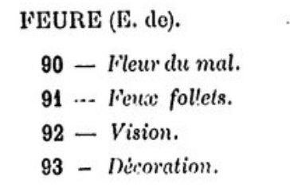
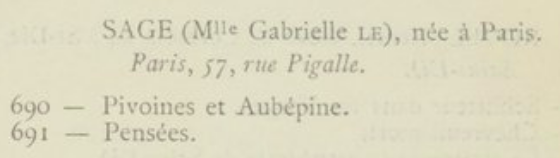
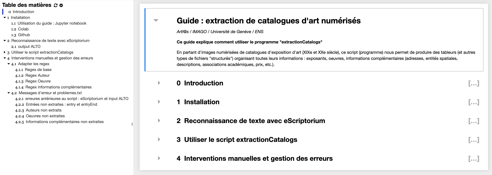

# extractionCatalogs : data extractor for 19th and 20th centuries art exhibition catalogs 
      
   
   <p class="float" align="center">
      
      
      
   </p>

This two step pipeline (eScriptorium + python script) aims to create TEI encoded art exhibition catalogs and CSV tables containing their data.

After an automatic/manual transcription with eScriptorium OCR (optical carachter recognition), the user will use the python script contained in this repository. It contains a Jupyter notebook file which serves as an interface for executing it. 

You may find complete and detailed instructions in the ```Guide - extraction de catalogues.ipynb``` file :

<p class="float" align="center">
   
</p>

## inputs/outputs
<br>eScriptorium</br> 

- input : iiif manifest or pdf, jpeg, png, etc. 

- output : XML ALTO files

<br> python script : </br> 

- input : XML ALTO files produced by eScriptorium

- output : XML TEI and CSV files

The script output is an XML-TEI file which combines all the ALTO transcriptions and sticks to the [ODD](https://github.com/carolinecorbieres/ArtlasCatalogues/blob/master/5_ImproveGROBIDoutput/ODD/ODD_VisualContagions.xml) done by Caroline Corbières. 

The ```/exemples_output``` directory contains examples of data produced by this pipeline.
   
   
## Instructions 

For complete instructions, use the Jupyter notebook integrated guide. This pipeline has a pedagogic vocation, so the guide is designed to introduce students with no prior technical knowledge to Digital Humanities. The python script can be executed directly from the notebook, so students may work without using the terminal.

1. Automatic/manual transcription of a digitized catalog with eScriptorium. Segmentation must be conformant to Segmonto Ontology.

2. Script execution with the following command :

```python3 run.py input output title```
- ```python3 run.py``` : python execution commands
- ```input``` : path to the directory containing ALTO transcribed catalog pages
- ```output``` : path to the desired repository for the output (TEI + CSV)
- ```title``` : catalog title (will be used for directorys and XML internal IDs)


## Installation
  - Clone the repository: ```git clone https://github.com/Juliettejns/extractionCatalogs```
  - Create virtual environment: ```virtualenv -p python3 env```
  - Run the virtual env: ```source env/bin/activate```
  - Install the requirements: ```pip install -r requirements.txt```
  - Stop the virtual env: ```source env/bin/deactivate```


## Credits
This repository was first developed as a prototype by Juliette Janes in 2021. The project was further augmented by Esteban Sánchez Oeconomo in 2022.

Both former students in Digital Humanities at Paris Science-Lettres University and interns of the [Artl@s](https://artlas.huma-num.fr/fr/) 
project worked under the direction of Béatrice Joyeux-Prunel and Simon Gabay.


## Licence
The code is CC-BY.</br>


## Cite this repository
Juliette Janes, Esteban Sánchez Oeconomo, Simon Gabay, Béatrice Joyeux-Prunel, _extractionCatalogs: Python data extractor for exhibition catalogs_, 2022, Paris: ENS Paris https://github.com/Juliettejns/TEIcatalogs/


## Contacts
If you have any questions or remarks, please contact juliette.janes@chartes.psl.eu, esteban.sanchez.oeconomo@chartes.psl.eu or simon.gabay@unige.ch.

